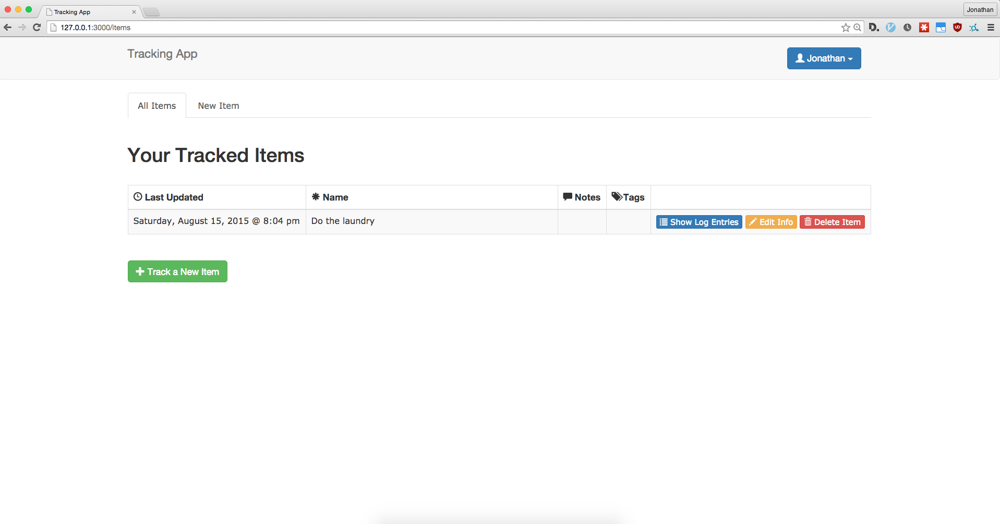
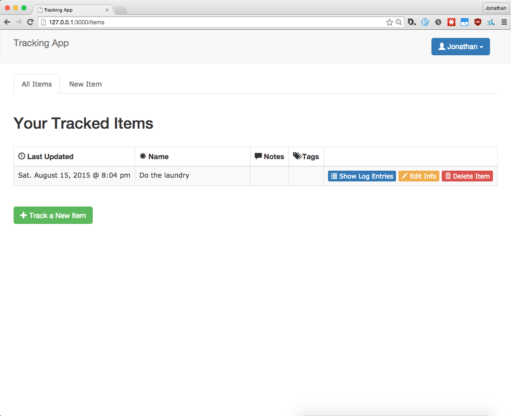
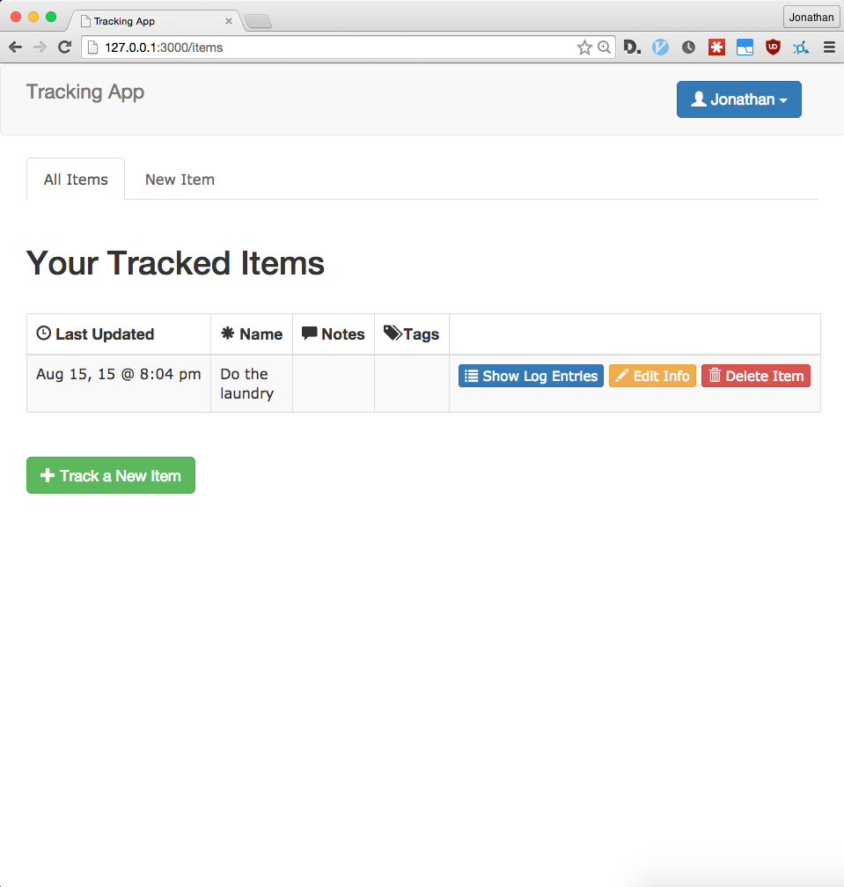

# Daily todo list app

Simple Ruby on Rails app I started on to manage daily todos and learn some CSS. Uses Bootstrap SASS and dynamically resizing responsive text fields. Uses devise for user accounts.

Date authored: May 20, 2015.

Showing dynamically resizing datetime fields at different window resolutions:

Large window resolution with full datetime:

Medium window resolution with smaller datetime:

Half-screen window resolution with compact datetime:

